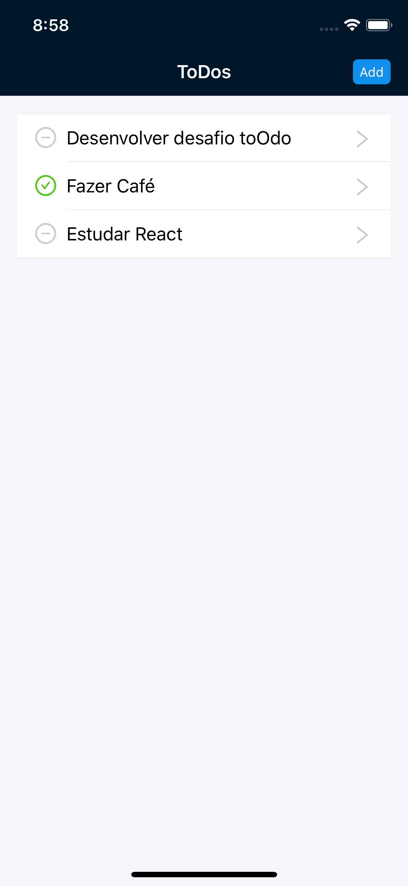
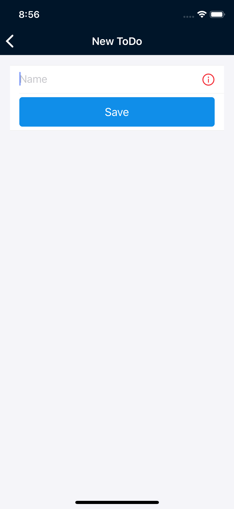
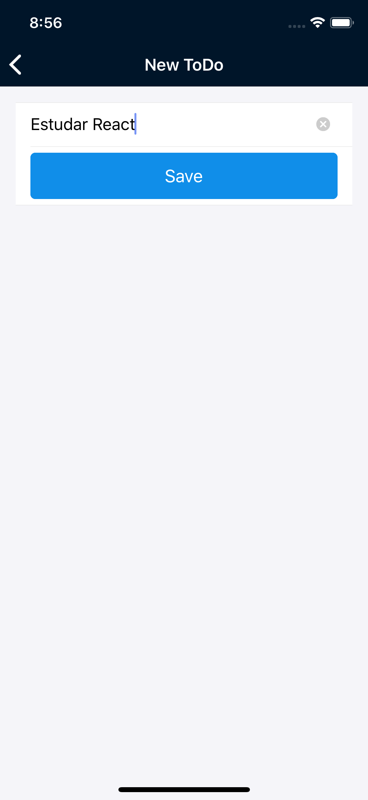
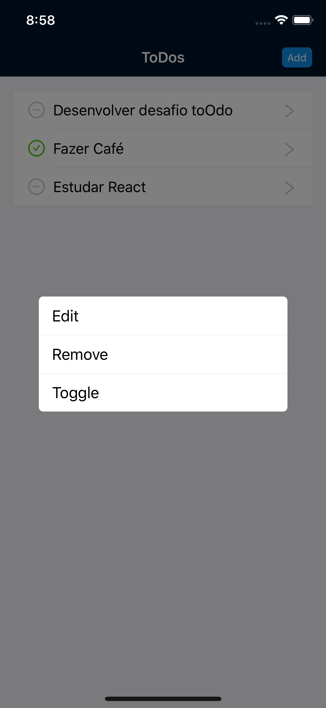

This project was bootstrapped with [React Native CLI](https://github.com/react-native-community/cli).

## "Reactive Core Architecture"

As this project has a web app and a native app that has the same business rule, I will use the concept of "Reactive Core Architecture". This way we will be able to share all the code "Redux" between the platforms. For more information see the [original post](https://medium.com/kuralabs-engineering/reactive-core-architecture-for-react-native-and-react-applications-d590daf4ef8a).

## Libraries

- [React Native](https://facebook.github.io/react-native/)
- [Ant Design of React Native](https://rn.mobile.ant.design/)
- [Styled Components](https://www.styled-components.com/)
- [Formik](https://jaredpalmer.com/formik/)
- [Yup](https://github.com/jquense/yup)
- [React Navigation](https://reactnavigation.org/)
- [Redux](https://redux.js.org/)
- [Redux Persist](https://github.com/rt2zz/redux-persist)
- [TypeScript](https://www.typescriptlang.org/)

## Core

- [Repository](https://github.com/raivieiraadriano92/challenge-toodo-core)

## Web App

- [Repository](https://github.com/raivieiraadriano92/challenge-toodo-web)

## Quickstart

Clone the project:

`git clone --recursive https://github.com/raivieiraadriano92/challenge-toodo-app.git`

In the project directory, you can run:

`yarn install`

`react-native run-ios or run-android`

## Screen Shots

  
  
  
  

